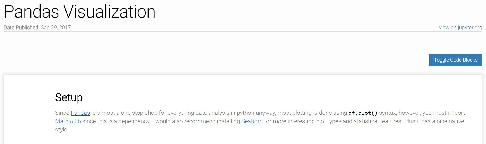

# Writing Notebooks Procedure

  1. **spin up a `jupyter notebook` (or `jupyter lab`) server and create a `.ipynb` file in `~/_notebooks/jupyter`, or create a new notebook on Databricks and export to `.ipynb`**
  2. from the command line **run `jupyter nbconvert --to html --template template.tpl <NOTEBOOK.ipynb>`** (using this site's custom nbconvert template)
  3. **create new `.md` file in `/_notebooks`**
    - add `title` to YAML frontmatter (title needs to be same as `.ipynb` filename, "*slugified*" to access file from [nbviewer](nbviewer.jupyter.org))
    - add `date` to YAML frontmatter
    - author is inherited from YAML defaults in `_config.yml`
    - if from databricks, add `type` to YAML frontmatter and set to "databricks" (the default setting for `type` is "jupyter")
    - if from databricks, add the publicly published url id as `databricks_id` to YAML frontmatter
  4. **include an excerpt followed by `<!-- excerpt separator -->`**
    - excerpt should be short and concise (not full sentence), it is used as notebook description in Bootstrap Cards
  5. **embed the html version of the notebook by using ``** where `path_to` is either jupyter or databricks folder

Optionally, add `publish: False` in YAML front matter to hide notebooks on live site (these are NOT ignored by git!)  

## Sample Notebook Setup

```yaml
---
title: Pandas Visualization
date: '2017-09-30'
---
```

```html
A template for creating notebooks...

<!-- excerpt separator -->


```

# Custom Template

This site's custom html template for notebooks, found at `~/_notebooks/jupyter/template.tpl`, is *almost* a carbon copy of the "Full" template provided on [Jupyter's nbconvert GitHub](https://github.com/jupyter/nbconvert/blob/master/nbconvert/templates/html/full.tpl). Minor tweaks were made to allow their template to be embedded inside this site's "page" layout.

Running list of everything changed from default template.
  - remove `<!DOCTYPE html>` from the `.html` file

The template is utilized by adding `--template` keyword when running `jupyter nbconvert`, to convert the `.ipynb` to `.html`.  

# Toggle Code Blocks

An added feature to the site's notebooks is the ability to hide code blocks and view only the output. Below is an example of how to do this in the notebook itself.  

```
%%html

<script>
    $('#toggle_code_blocks').click(function(){
        $('div.input').toggle();
    });
</script>

<button id="toggle_code_blocks" class="btn-default" rel="tooltip" title="Click to toggle code blocks">Toggle Code Blocks</button>
```
We alternatively put this code in our notebook layout, at `_layouts/notebook.html`. Below is a screenshot of how the button shows on a published notebook.  



# Pin

This site pins notebooks to a "Recent Notebooks" section on https://knanne.github.io/notebooks/. As defined in the `_config.yml`, all notebooks have pin set to True by default. Currently only the last 3 most recent notebooks will be shown. To exclude a notebook from being pinned, set `pin: False` in the notebook's YAML frontmatter.   

# Important Caveats

When embedding images in a notebook, using for example a direct link to `img\image.png`, the image will show up fine on GitHub or nbviewer however not on the website. This is because you are viewing the Markdown `.md` of the post on the site, where the path to image is now different. Fixing this by using a dynamic liquid tag to the image would break the image links rendered on GitHub or nbveiwer. Therefore, manually go into the `.html` version of the notebook and correct the path.
